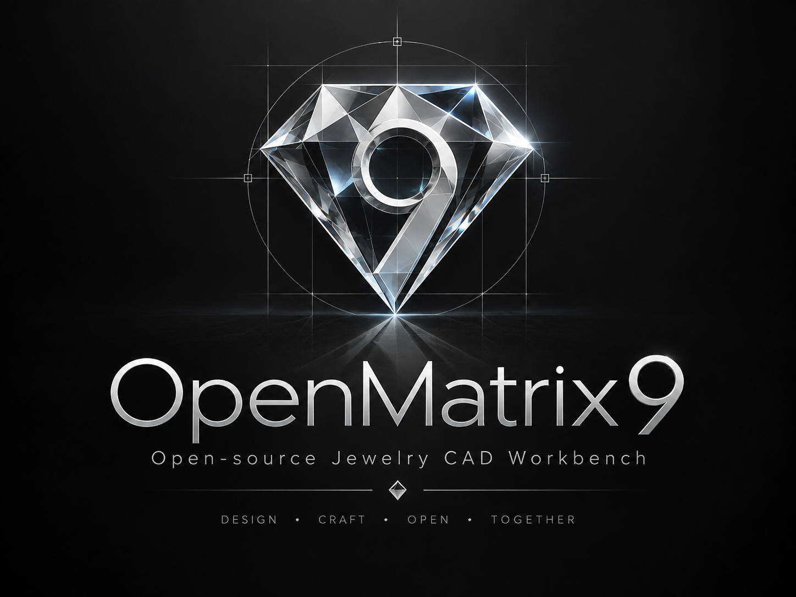

# OpenMatrix9 — English

[Tiếng Việt](README.vi.md) · [Detailed command list](README.md)



OpenMatrix9 is an experimental jewelry CAD workbench for FreeCAD, developed
with Matrix9 as a functional reference. Rust owns the command catalog, state
and behavior; C++/Qt integrates native FreeCAD geometry and UI; Python registers
the workbench.

## Table of contents

- [Overview](#overview)
- [Support development / Donate](#donate)
- [Completion rules](#completion-rules)
- [Progress by major group](#group-progress)
- [Supported workflows](#supported-workflows)
- [Rhino 3DM / openNURBS compatibility](#three-dm)
- [Build and installation](#build)
- [Checks](#checks)
- [Documentation and progress updates](#documentation)
- [License](#support-license)

<a id="overview"></a>
## Overview

The UI organizes CAD and jewelry commands into groups, with a CMD area, four
viewports, an F6 menu and display controls. Unsupported commands remain visible
and disabled. The project has **510 independently authored SVG icon bindings**;
icon counts do not measure completed functionality.

<a id="donate"></a>
## Support development / Donate

If OpenMatrix9 is useful to you, you can donate to support the development and
testing of CAD features, 3DM import/export and openNURBS compatibility.
All contributions are voluntary. Thank you for supporting the project!

- **PayPal:** send to **`nguyenthaiduy277@gmail.com`** through PayPal.
- **MoMo:** scan the QR code below. Recipient: **NGUYEN THAI DUY**.


<a id="completion-rules"></a>
## Completion rules

Updated from development workspace progress documentation dated **2026-10-09**.
These READMEs are published ahead of the corresponding code and acceptance
documents. The table records scope validated in the workspace; it does not
confirm that every change is available in a GitHub clone. The detailed table
and ledger on GitHub may retain an earlier baseline until implementation changes
are integrated.

The table below summarizes
the [detailed command table](README.md#tiến-độ-lệnh--command-progress), cross-checked
against the [evidence ledger](docs/openmatrix9-progress.json) and
Spec v1 implementation status (`OpenMatrix9_Codex_Spec_v1/IMPLEMENTATION_STATUS.md`,
a workspace document awaiting publication).

- **Completed current scope:** a 🟢 entry in the detailed table, with execution
  and checks for its documented scope. Missing options remain documented per
  command; this status does not certify full Matrix9/Rhino compatibility.
- **Partial:** a 🟡 entry with a working foundation but remaining limitations or
  integration work. These entries do not contribute to the completed count.
- **Not completed:** a 🔴 entry without a confirmed execution path in the source table.
- **Total:** catalog entries or additional commands listed in that group.
  Rate = completed current scope / group total × 100, rounded to one decimal place.

The same identifier may occur in multiple groups. Do not add table rows to
calculate overall project completion: the list contains **513 unique
identifiers**, including **58 🟢, 2 🟡 and 453 🔴**. Editor shares
the Curve catalog; Custom and Reset are sidebar controls and do not add CAD groups.

Spec v1 uses a different unit: **607 features**, currently recording
**18 `partially_implemented`** and **589 `not_started`**.
A feature may have a validated supported slice while remaining partially
implemented against its full specification.

<a id="group-progress"></a>
## Progress by major group

Each row represents one major group. Follow its name for individual commands,
supported scope and limitations.

| No. | Major feature group | Completed current scope / Total | Rate | Partial | Not completed |
|---:|---|---:|---:|---:|---:|
| 1 | [Quick tools](README.md#quick-tools--thao-tác-nhanh) | **3/11** | 27.3% | 0 | 8 |
| 2 | [File](README.md#file) | **5/13** | 38.5% | 0 | 8 |
| 3 | [View](README.md#view) | **10/15** | 66.7% | 0 | 5 |
| 4 | [Utilities](README.md#utilities) | **0/22** | 0.0% | 0 | 22 |
| 5 | [Measure](README.md#measure) | **2/17** | 11.8% | 0 | 15 |
| 6 | [Curve](README.md#curve) | **6/58** | 10.3% | 0 | 52 |
| 7 | [Surface](README.md#surface) | **3/40** | 7.5% | 0 | 37 |
| 8 | [Solid](README.md#solid) | **6/30** | 20.0% | 0 | 24 |
| 9 | [Transform](README.md#transform) | **0/40** | 0.0% | 0 | 40 |
| 10 | [Clayoo / SubD](README.md#clayoo--subd) | **0/58** | 0.0% | 0 | 58 |
| 11 | [Emboss](README.md#emboss) | **0/7** | 0.0% | 0 | 7 |
| 12 | [Builder](README.md#builder) | **0/16** | 0.0% | 0 | 16 |
| 13 | [Jewelry tools](README.md#tools) | **0/31** | 0.0% | 0 | 31 |
| 14 | [Gems](README.md#gems) | **0/35** | 0.0% | 0 | 35 |
| 15 | [Gem settings and prongs](README.md#settings--ổ-đá-và-chấu) | **0/12** | 0.0% | 0 | 12 |
| 16 | [Cutters](README.md#cutters) | **0/11** | 0.0% | 0 | 11 |
| 17 | [Render](README.md#render) | **0/23** | 0.0% | 0 | 23 |
| 18 | [Core / project / selection](README.md#core--project--selection) | **5/11** | 45.5% | 0 | 6 |
| 19 | [Additional view and display controls](README.md#view-và-display-bổ-sung) | **10/22** | 45.5% | 0 | 12 |
| 20 | [Snaps / constraints](README.md#snap--ràng-buộc) | **4/17** | 23.5% | 0 | 13 |
| 21 | [Properties / history / settings / layers](README.md#properties--history--settings--layers) | **3/26** | 11.5% | 0 | 23 |
| 22 | [Dedicated 3DM commands / keyboard](README.md#3dm-chuyên-biệt--keyboard) | **1/3** | 33.3% | 2 | 0 |

<a id="supported-workflows"></a>
## Supported workflows

- **Projects and UI:** New, Open, Save, Save As, Notes, Undo/Redo, object
  selection/deletion, four viewports, standard views, zoom, reference images and F6.
- **Curves:** Line, Polyline, Interp Curve, Rebuild, Rectangle and Circle within
  their [documented feature scope](docs/features/).
- **Surfaces and solids:** Sweep1, Sweep2, Loft, Box, Sphere and four Boolean
  commands; see `OpenMatrix9_Codex_Spec_v1/IMPLEMENTATION_STATUS.md` (awaiting publication).
- **Editing and measurement:** Trim, Join, Explode, Distance, Angle; End, Point
  and Midpoint snaps, plus Ortho constraints in supported tools.

Advanced branches, associative History, layers and specialist adapters retain
individual limitations. Consult the [Edit contract](docs/features/edit-native-contract.md)
and [validation reports](docs/validation/) before relying on a particular option.

<a id="three-dm"></a>
## Rhino 3DM / openNURBS compatibility

3DM import/export is partially implemented. Current scope includes supported
point/curve, surface/BRep and mesh conversion, basic geometry metadata, source
snapshots in FCStd and geometry export targeting Rhino 5 archives.

Snapshot retention does not establish full display, editing or export support.
Structural block preservation, materials/textures, annotations and History/plugin
userdata retain limitations. Work tested in a separate development workspace
but awaiting integration is not counted as available in the current source.
See the 3DM exchange section in the [detailed README](README.md) for the latest published status.

<a id="build"></a>
## Build and installation

Use the [Windows guide](docs/build-windows.md), written in Vietnamese, to choose
a combined FreeCAD/OM9 build, a standalone OM9 build against a matching SDK, or
a compatible binary for an installed FreeCAD. The module requires matching
SDK/ABI components; cloning it into `Mod` alone is insufficient.

The documented baseline is Windows x64, MSVC and Qt6, with Rust supporting
edition 2024, CMake, Python and dependencies matching the FreeCAD SDK.
Linux/macOS have not been validated for this module. Integration details:
[build and validation](docs/build.md).

<a id="checks"></a>
## Checks

Run from the OpenMatrix9 directory in the matching build environment:

```powershell
cargo test --manifest-path rust/Cargo.toml
python -m unittest discover -s tools/tests
python tools/public_source_audit.py
```

Native macros and executable/dependency selection are described in the
[validation guide](docs/build.md). Passing test counts certify tested scope,
not completed feature counts. The current workspace retains private reference
artifacts recorded by the source audit; review its results and the progress
ledger before distribution.

<a id="documentation"></a>
## Documentation and progress updates

- [Detailed README](README.md): catalog identifiers, meanings, status and limits.
- [Progress ledger](docs/openmatrix9-progress.json): evidence, test runs,
  unverified behavior and next actions.
- `OpenMatrix9_Codex_Spec_v1/INDEX.md`: feature lookup by group and ID (awaiting publication).
- [Native reports](docs/validation/): validated scope for implementation work.
- [Windows build](docs/build-windows.md) and [build/validation](docs/build.md).

After implementing and checking a feature, update the ledger, relevant spec and
detailed table in `README.md`; then synchronize counts, dates and limitations
in both `README.vi.md` and `README.en.md`. Keep the same counting unit and status
in both editions. Icons, command names or validator tests alone do not advance
implementation status.

<a id="support-license"></a>
## License

The project declares **LGPL-2.1-or-later**: see [LICENSE](LICENSE) and
[third-party notices](THIRD_PARTY_NOTICES.md). OpenMatrix9 is an independent
project; it does not claim vendor affiliation, clean-room development or legal
clearance of the implementation. Source context and publication audit are
documented in the [detailed README](README.md) and
[source review](docs/public-source-review.md).
